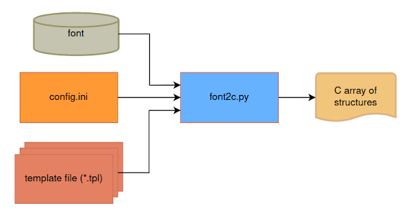

# font2c
A python script that converts font to C array, target for embedded systems (e.g. LCD Controller ILI9806)



Prerequisite: Python3<br/>
Additional Python Library: Pillow (PIL fork)<br/>
Usage:<br/>
 - Load the font properties from config file: python3 font2c.py config.ini<br/>
 - Use default setting: python3 font2c.py

Output sequence: Left to right, down to bottom sequentially

#### Preview:


| Configuration | Description |
|       ---     |     ---     |
| bpp                             | bit per pixel ( 1 or 2 ), 2 is smoother but occupy more size |
| font = /usr/share/fonts/truetype/freefont/FreeSans.ttf | font style <br/>(Windows platform: cour)          |
| size = 32                       | font size                                                                |
| text = 0123456789:<br/>abcdefghijklmnopqrstuvwxyz<br/>ABCDEFGHIJKLMNOPQRSTUVWXYZ | output characters       |
| offset = (0,0)                  | x,y offset                                                               |
| fixed_width_height = None       | None: Flexible size<br/>(width, height): Fixed width and height          | 
| max_width = 32                  | maximum width                                                            |
| calc_margin = true              | calculate margin area                                                    |
| encoding_method = raw           | encoding method<br/>raw=direct dump the pixels inside margin area<br/>rle=RLE compression, accumulate numbers of 0 and 1 in nibble size inside margin area<br/> |
| template_file_path = ['./bmp.tpl', <br/>'./font_table_width_height_margin_index.tpl'] | template file path |
| export_dir = ./export/          | export directory                                                         |

#### Template files to generate C array structure:
| bpp | fixed_size | calc-margin | encoding | template files                                                    | estimated size    |
| --- |    ---     |    ---      |    ---   |                         ---                                       |       ---         |
|  1  |      0     |      0      |  raw(0)  | bmp.tpl + font_table_width_height_index.tpl                       |  XXXXX            |
|  1  |      0     |      0      |  rle(1)  | bmp.tpl + font_table_width_height_index.tpl                       |  XXXXX            |
|  1  |      0     |      1      |  raw(0)  | bmp.tpl + font_table_width_height_margin_index.tpl                |  XXXX             |
|  1  |      0     |      1      |  rle(1)  | bmp.tpl + font_table_width_height_margin_index.tpl                |  XXXX             |
|  1  |      1     |      0      |  raw(0)  | bmp_fixed_array_size.tpl                                          |  XXXXXXX          |
|  1  |      1     |      0      |  rle(1)  | bmp.tpl + font_table_index.tpl                                    |  XXXXX            |
|  1  |      1     |      1      |  raw(0)  | bmp.tpl + font_table_margin_index.tpl                             |  XXX              |
|  1  |      1     |      1      |  rle(1)  | bmp.tpl + font_table_margin_index.tpl                             |  XX               |
| --- |    ---     |    ---      |    ---   |                         ---                                       |       ---         |
|  2  |      0     |      0      |  raw(0)  | bmp.tpl + font_table_width_height_index.tpl                       |  XXXXXXX          |
|  2  |      0     |      0      |  rle(1)  | bmp.tpl + bpp.tpl + font_table_width_height_index_2bpp.tpl        |  XXXXXXX          |
|  2  |      0     |      1      |  raw(0)  | bmp.tpl + font_table_width_height_margin_index.tpl                |  XXXXXX           |
|  2  |      0     |      1      |  rle(1)  | bmp.tpl + bpp.tpl + font_table_width_height_margin_index_2bpp.tpl |  XXXXXX           |
|  2  |      1     |      0      |  raw(0)  | bmp_fixed_array_size.tpl                                          |  XXXXXXXXX        |
|  2  |      1     |      0      |  rle(1)  | bmp.tpl + bpp.tpl + font_table_index_2bpp.tpl                     |  XXXXXXX          |
|  2  |      1     |      1      |  raw(0)  | bmp.tpl + font_table_margin_index.tpl                             |  XXXXX            |
|  2  |      1     |      1      |  rle(1)  | bmp.tpl + bpp.tpl + font_table_margin_index_2bpp.tpl              |  XXXX             |


**Example 1: Output with fixed width and height(14,24), calc_margin set to true, encoding method set to raw, use bmp.tpl and font_table_margin_index.tpl as template files, the generated c source file and preview font images are placed under './export' directory**
```python
    font = "cour"                           # font style (Test chinese font: kaiu)
    size = 24
    text = "0123456789:"                \
           "abcdefghijklmnopqrstuvwxyz" \
           "ABCDEFGHIJKLMNOPQRSTUVWXYZ"     # "測試間距テスト"  # output which symbol
    offset = (0,0)
    fixed_width_height = (14,24)            # fixed width and height
    max_width = 24
    calc_margin = true
    encoding_method = raw
    template_file_path = ['./bmp.tpl', './font_table_margin_index.tpl']
    export_dir = "./export/"
```

**Example 2: Output with flexible font size, calc_margin set to true, encoding method set to raw, use bmp.tpl and font_table_width_height_margin_index.tpl as template files, the generated c source file and preview font images are placed under './export' directory**
```python
    font = "arial"                          # font style (Test chinese font: kaiu)
    size = 32
    text = "0123456789:"                \
           "abcdefghijklmnopqrstuvwxyz" \
           "ABCDEFGHIJKLMNOPQRSTUVWXYZ"     # "測試間距テスト"  # output which symbol
    offset = (0,0)
    fixed_width_height = None               # var_size
    max_width = 32
    calc_margin = true
    encoding_method = raw
    template_file_path = ['./bmp.tpl', './font_table_width_height_margin_index.tpl']
    export_dir = './export/'
```
