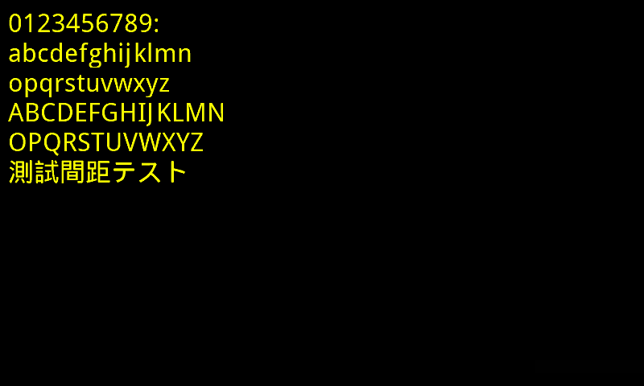

# font2c
A python script that converts font to C array, target for embedded systems (e.g. LCD Controller ILI9806)


Prerequisite: Python3<br/>
Additional Python Library: Pillow (PIL fork)<br/>
Usage:<br/>
 - Load the font properties from config file: python3 font2c.py config.ini<br/>
 - Use default setting: python3 font2c.py

Output sequence: Left to right, down to bottom sequentially

#### Preview:


| Configuration | Description |
|       ---     |     ---     |
| [microhei32_varsize_rawbb_2bpp] | export C file name                                      |
| bpp = 2                         | bit per pixel ( 1 or 2 ), 2 is smoother but occupy more size |
| font = /usr/share/fonts/truetype/wqy/wqy-microhei.ttc | font style ( True Type Font / Open Font )<br/>(Windows platform: kaiu.ttf) |
| size = 32                       | font size                                                                |
| text = 0123456789:<br/>ABCDEFGHIJKLMNOPQRSTUVWXYZ<br/>abcdefghijklmnopqrstuvwxyz<br/>測試間距テスト | output characters (sorted before export)      |
| offset = (0,0)                  | x,y offset                                                               |
| fixed_width_height = None       | None: Flexible size<br/>(width, height): Fixed width and height          | 
| max_width = 32                  | maximum width                                                            |
| encoding_method = rawbb           | encoding method<br/>raw=direct dump the pixels<br/>rawbb=direct dump the pixel inside margin area (bounding box)<br/>lvgl=use lvgl compression algorithm (currently prefilter set to disable)<br/>|
| export_dir = ./export/          | export directory                                                         |

**Example 1: Output with fixed width and height(14,24), encoding method set to rawbb, the generated c source file and preview font images are placed under './export' directory**
```python
    font = "cour"                           # font style (Test chinese font: kaiu)
    size = 24
    text = "0123456789:"                \
           "ABCDEFGHIJKLMNOPQRSTUVWXYZ" \
           "abcdefghijklmnopqrstuvwxyz"     # "測試間距テスト"  # output which symbol
    offset = (0,0)
    fixed_width_height = (14,24)            # fixed width and height
    max_width = 24
    encoding_method = rawbb
    export_dir = "./export/"
```

**Example 2: Output with flexible glyph size, encoding method set to rawbb, the generated c source file and preview font images are placed under './export' directory**
```python
    font = "arial"                          # font style (Test chinese font: kaiu)
    size = 32
    text = "0123456789:"                \
           "ABCDEFGHIJKLMNOPQRSTUVWXYZ" \
           "abcdefghijklmnopqrstuvwxyz"     # "測試間距テスト"  # output which symbol
    offset = (0,0)
    fixed_width_height = None               # var_size
    max_width = 32
    encoding_method = rawbb
    export_dir = './export/'
```
#### Template Keyword Description
| Template keyword      | Description                                 |
|        ---            |     ---                                     |
| ${bpp}                | bpp option                                  |
| ${font}               | font option                                 |
| ${font_lowercase}     | font in lowercase                           |
| ${font_uppercase}     | font in UPPERCASE                           |
| ${size}               | font size option                            |
| ${encoding_method}    | encoding method option                      |
| ${template_file_path} | current template file name                  |
| ${charname}           | character name                              |
| ${charname_lowercase} | character name in lowercase                 |
| ${charname_uppercase} | character name in UPPERCASE                 |
| ${codepoint}          | character UTF-8 codepoint                   |
| ${margin_top}         | character margin top                        |
| ${margin_bottom}      | character margin bottom                     |
| ${margin_left}        | character margin left                       |
| ${margin_right}       | character margin right                      |
| ${width}              | character width                             |
| ${height}             | character height                            |
| ${sizeof_char}        | character bmp byte size                     |
| ${bmpdata}            | character bmp data                          |
| ${bmpidx}             | character bmp index                         |


